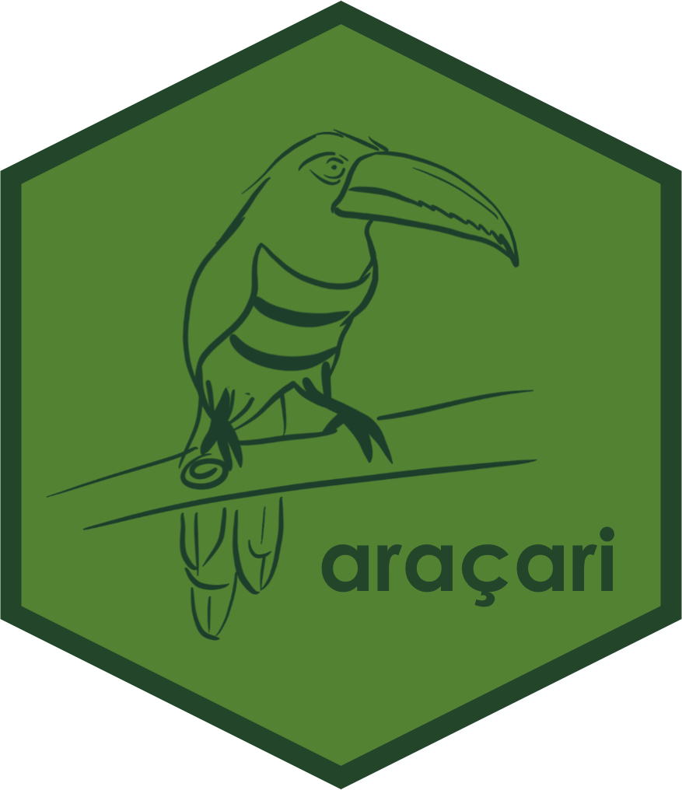

<!-- README.md is generated from README.Rmd. Please edit that file -->

# aracari 

<!-- badges: start -->

<!-- badges: end -->

My dissertation work is focused on the ecological consequences of individual variation in animal movement, from a modeling perspective. 

- CH1 - Consequences of incorporating heterogeneity in animal movement rates into models of seed dispersal. [Figures](https://javirudolph.github.io/aracari/Ch1_movement_rates/Ch1_Figures.html) and an [Appendix](https://javirudolph.github.io/aracari/Ch1_movement_rates/Ch1_Appendix_A.html)

- CH2 - [Figures](https://javirudolph.github.io/aracari/Ch2_distributions/Ch2_Figures.html)

-----

## Installation

You can install the development version from
[GitHub](https://github.com/) with:

``` r
# install.packages("devtools")
devtools::install_github("javirudolph/aracari")
```
