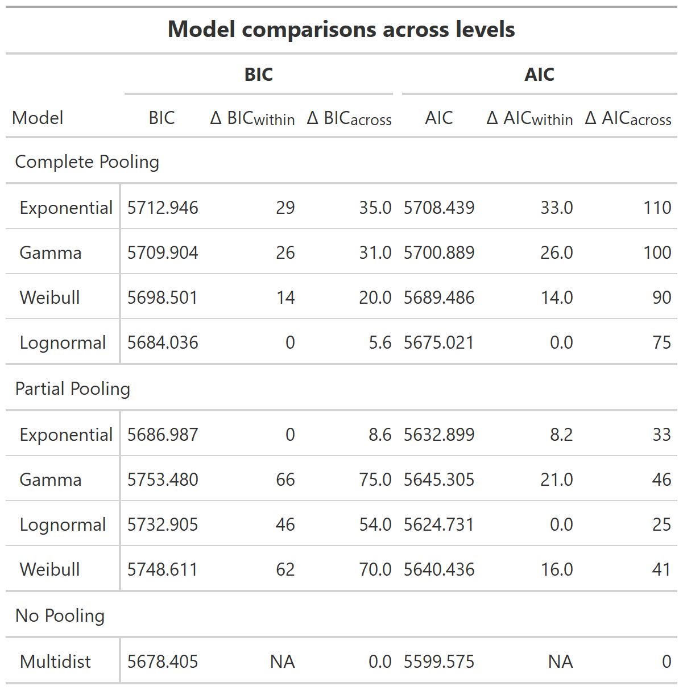

# Introduction

Movement is a fundamental ecological process, critical to an animal's biology and it's interactions with the environment. The study of animal movement tends to focus on four basic mechanistic questions: the why, when, where, and how an animal moves, and these questions can be answered at the scale of individuals or populations. A general framework for movement ecology is needed to link movement patterns and processes. Such a framework would start with a focus on movement itself and the individual's internal state, navigation capacity, motion capacity, and responses to external factors [@nathan2008movement]. The overall goal of studying movement is to find the linkages between the causes and mechanisms of animal movement, that explain spatiotemporal patterns that then feed back into various ecological and evolutionary processes. However, we can also focus on the effects and consequences that different movement patterns can have over species interactions and other ecological processes.

Random walks have been used broadly in biology to model movement of animals and microorganisms, starting with the simplest models of movement using uncorrelated and unbiased random walks [@codling2008random]. These movement models show no preference in direction and movement at each step is completely independent of the direction taken in previous movements. Extensions of simple random walk processes are regularly used to accommodate for more complex behaviors or to include drift. Some of these extensions involve the use of correlated random walks, which incorporate a correlation between directions in successive movements, biased random walks, which incorporate a directional bias, or even building movement models as mixtures of random walks to account for more complex behaviors [@morales2004extracting]. Modeling approaches using random walks generally assume a homogeneous environment and behaviors that don't drastically change the movement pattern [@kareiva1983analyzing]. A simple random walk approximates displacements by connecting a series of straight lines, and can summarize animal movement based on parameters for movement length and turning angle, or the use of net squared displacement. Connecting theoretical movement models based on correlated random walks to data had often relied on the use of these parameters or displacement measures [@turchin1998quantitative], but more current and efficient approaches have used likelihood-based techniques to estimate parameters by fitting a discrete approximation of the model directly to the location data [@jonsen2003meta].

   In the context of species interactions and the consequences of animal movement to dispersal, the general focus has been on understanding how the typical movement patterns, built around average measures at population levels, can influence plant population spread [@levey2005effects], seed dispersal [@jones2017closing, @holbrook2007using], pollen dispersal [@garcia2007contemporary], and even pathogens [@shaw2017vector]. Animal movement can be modeled with a simple diffusion process or a random walk [@jones2017closing; @levey2005effects], with the simplest approach assuming model parameters are the same across individuals, something known as 'complete pooling' [@langrock2012flexible]. This focus on generality has driven to a lack of frameworks for understanding how variation in animal movement is maintained, and the consequences of this variation across populations and communities. From the animal movement perspective, some alternatives have been considered to incorporate individual variation with 'no pooling' or 'partial pooling' approaches, where each or some individuals have their own set of parameters [@patterson2009classifying, @jonsen2006robust], however a high number of parameters quickly limits applications to high levels of individual variation. The decision to pool data or not may also come from the modeling framework chosen, as frameworks that allow for random effects may have a better structure to incorporate this variation than simpler frameworks. Recent calls for incorporating individual variation in movement and their consequences to seed dispersal or even pathogen spread [@snell2019consequences, @shaw2020causes] have pushed for the need to develop theory that explores different types of variation in movement patterns to understand its consequences across ecological organizational levels. In particular, when considering species interactions, incorporating individual variation becomes essential to understand how positive or negative feedback loops play into the maintenance of variation in movement as individuals respond to external factors in their environment.
  
Animal telemetry data are collected by determining an animal's location at various points in time. Many of the movement models used to analyze animal telemetry data rely on regular time intervals between locations [@jonsen2003meta; @jonsen2005robust]. However, based on field methods, or environmental variables such as heavy cloud cover or dense forest, can make data collection at regular intervals difficult, and thus location data becomes more opportunistic and with irregular time intervals. Previous methods to analyze data under these irregular conditions have relied on interpolating, subsampling, or aggregating data during pre-processing in order to make it fit model assumptions[@johnson2008continuous]. In this study, we propose the use of a model capable of handling irregular time intervals by considering movement as a stochastic process on a continuous time scale, and thus focus on the animal's instantaneous velocity rather than on its absolute displacements between locations. Using this continuous-time framework, we are able to estimate movement paths by integrating velocity functions. We also explore the effects of individual variation in speeds as a comparison between velocity probability density functions across different levels of data aggregation between individuals. Unlike other studies which focus on deciphering the underlying behaviors from animal movement data, our focus was to uncover potential differences between individuals and how these differences can be obscured when modeling population-level animal movement. We know these simple correlated random walks, or simple movement models might not be enough to describe net displacements under more complex processes, for which developments in state-space modeling frameworks show to be promising. However, our goal in this study was to use a simpler model that would adjust to irregular and sparse telemetry data, and focus on potential differences that arise when comparing data from multiple individuals under frameworks that completely pool data in contrast to those that don't. We illustrate the use of this model and the individual variation comparison by analyzing a telemetry data set of twelve many-banded aracari individuals, *Pteroglossus pluricinctus*. 

# Methods

## Velocity-based continuous-time model

We developed an animal movement model with telemetry data in mind, thus we considered a movement trajectory as a series of consecutive recordings of an animal's location. To first set up the framework for a velocity-based model, we consider movement as the change in locations across two coordinates. We let $\boldsymbol{u}(t)=[u_x(t), u_y(t)]'$ be the location of an individual at time $t$ in the coordinates $x$ and $y$. We establish $\boldsymbol{d}_{\Delta}(t) = \boldsymbol{u}(t+\Delta) - \boldsymbol{u}(t)$ as the difference in locations across both coordinates over $\Delta$ time units. The differential equation $d\boldsymbol{u}(t)=\boldsymbol{v}(t)dt$ represents the instantaneous velocity as $\Delta$ approaches zero under the assumption that $\boldsymbol{u}(t)$ is a continuous movement path [@johnson2008continuous]. Although the bivariate velocity process $\boldsymbol{v}(t) = [u_x(t), u_y(t)]'$ could be considered as cross-correlated between the axes, these correlated velocities produce strange directed travel and thus velocity in each coordinate is considered to be an independent process [@johnson2008continuous]. We decided instead, to focus on a velocity-based movement process using velocity scalars and turning angles. Under this framework, we define a scalar for instantaneous directionless velocity as 
$$v(t+\Delta) = \sqrt{(u_x(t+\Delta)-u_x(t))^2 + (u_y(t+\Delta) - u_y(t))^2}$$
and assume $v(t)$ to be a random variable with probability density $h(\boldsymbol\sigma)$ where $\boldsymbol\sigma$ represents the vector of parameters and determines the overall variability in velocity. We assumed velocities to be independent of turning angles and chose to describe each with a separate probability density function, which is common practice when using movement lengths [@kareiva1983analyzing]. We calculated the turning angle $\theta(t+\Delta)$ describing the turning direction of the animal at time $t+\Delta$ and assumed the distribution of angles along a continuous movement path to be distributed with probability density $g(\theta)$.  For the specific case of a correlated random walk, the distribution of $g(\theta)$ can be used as a measure of correlation in the direction of movement, where if no correlation is present, the distribution is uniform [@kareiva1983analyzing].  As in other papers, we adopt the convention of using upper case letters for random variables and lower case letters for possible numerical values of these random variables.

Using this velocity process and turning angles, the continuous-time location process $\boldsymbol{u}(t)$ can be obtained by integrating over the velocity process [@johnson2008continuous]:
$$\boldsymbol{u}(t) = \boldsymbol{u}(0) + \int_0^t\boldsymbol{v}(\tau)d\tau$$
where 
$$\int_0^t\boldsymbol{v}(\tau)d\tau =\int_0^t [v_x(\tau), v_y(\tau)]' d\tau = \int_0^t [\sin(\theta_\tau), \cos(\theta_\tau)]' \cdot v(\tau)d\tau$$
This integral describes the location at time $t$ as the sum of steps determined by velocities in each direction plus a starting location at time $t=0$.

## Model formulations
  
Assume weibull distributions for step length and wrapped cauchy distributions for the turning angles [@langrock2012flexible], but they tried Gamma and von Mises, respectively, but got outperformed by AIC. Used negative binomial for the state dwell times. 
  
Random walks used broadly in biology to characterize animal and cell movement. Describes que commonly used distributions for angles: von Mises, wrapped normal and wrapped Cauchy distributions. [@codling2008random]
- IDEA: so maybe use these distributions for the angles. We might see that there is not much difference in angle movement across individuals? They all tend to move forward perhaps, or something like that, and where the real differences are is in the distances. 
- Also might be intriguing to incorporate the time as a set of multiple random walks? or repeats the velocity value for that number of minutes. Maybe just using a correlated random walk, which takes into account short-term correlations in the direction of movement?
  - Codling describes this as a velocity jump process, since the markov process is the walker's velocity rather than the location. Details at the end of page 7. 
  - We consider the individuals moving in space at a constant speed $\nu$, and at each time step $\tau$ each individual changes direction and moves a distance $\delta$ in a new direction (with probability $r=\lambda\tau$), or moves a distance $\delta$ in the previous direction (with probability $q=1-\lambda\tau$). Hence, turning events occur as a Poisson process with rate $\lambda$. **This is textual from paper, so modify** Their focus is also on multiple individuals at the same time, and the density of individuals at a given time and location.
    - In my case, the distance $\delta$ would also be randomly sampled, or this are the velocities I suppose. So, perhaps it is constant speed, and the distance is actually times to account for 15, 30, etc minutes based on the data. 
    - Remember too that this velocity $\nu$ is actually the distance over time $\delta/\tau$
  - Pg11. A correlated random walk, CRW, consisting of a series of independet draws from a step length PDF and a turning angle PDF for each step, a first order markov process.
    - using mean square displacement. The effect of step length variability on MSD can be quite significant.
    - MSD being of interest to ecologists due to its relation with the diffusion coefficient D. equations 2.13 and 2.14
** Should write a conclusion about this paper**
  


[@kareiva1983analyzing] - approximating displacements by connecting a series of straight lines, and thus summarize animal movement based on parameters for movement length and turning angle. Using square displacement instead of linear displacement, because it's expectation can be calculated from turning angles and step lengths. Assume that the length of each move and the turning angle are independent random variables, each with its own probability density. Assume that a series of moves can be represented by random draws from these probability densities, and since each random draw is independent from the preceding ones, the random draw process is a first order markov chain. The result is a correlated random walk, and the distribution g(theta) gives a measure of the degree to which the angles of movement are correlated.
*Would be interesting to add a figure with what I am actually analyzing. So, visually show how the gps locations get turned into straight lines, and angles, with an associated time interval. Or we could just multiply everything? So have it all for 15 minute intervals, and then repeat the ones that went on longer, perhaps set a limit for 60 minutes?*


probabilistic rules of movement. 


  


"Location accuracy using radio telemetry may be reduced in tropical forests... conservative distance categories of 100-m increments to better represent precision. Time categories: 15, 30, 60, 90 minutes. Then calculated probability of movements made within each distance category within each time category, summed across each time category to give a final probability for each distance category."

"Distances travelled per movement bout ranged from 0 to >2000m. Strong leptokurtic distributions of movements with most being <300m. Longest recorded movement for Pluricinctus is 3665m (recorded in 30 minutes)" *this is a corresponding velocity of `r 3665/30` meters per minute.


Evaluating models with their individual-specific counterparts, using AIC or BIC. In individual-specific models the AIC results from the joint likelihood of the individual-specific models. 

## Model evaluation using information criteria  


$$AIC{_{indlevel}} = 2 \cdot \sum \left ( number parameters \right ) + 2 \cdot \sum \left ( negative log likelihood \right )$$

$$ AICc{_{indlevel}} =  AIC{_{indlevel}} + (2 \cdot \sum{nparams}  \cdot \left(\sum{nparams}+1\right)/\left(\sum{observations} - \left(\sum{nparams} - 1\right)\right)$$


$$BIC_{indlevel} = \ln{\sum observations} \cdot \sum{number parameters} + 2\cdot \sum {negative log likelihood}$$

## Example: Many-banded aracari movement  

We focused our study of individual variation on the many-banded araçari (*Pterglossus pluricinctus*), a small toucan in Yasuní National Park, Ecuador. We used previously collected data from studies using radiotelemetry to estimate home ranges and evaluate the potential seed dispersal distances for the *Virola flexuosa* tree [@holbrook2011home, holbrook2007usin]. Over a period of four years, from 2001 to 2005, *P. pluricinctus* individuals were captured and radio-transmitters were attached at the base of the central tail feathers [@holbrook2011home]. Toucan locations were estimated by triangulation using receivers and hand-held antennas, with tracking periods lasting between 4-5 hours per day, locating individual birds every 15 minutes. Further details on field methods can be found in Holbrook [-@holbrook2011home]. It is important to note that these methods did not track all birds simultaneously, and that although individual toucan locations were attempted every 15 minutes, this was not always possible, thus some successive locations have time categories associated to multiples of 15. Due to the nature of the data, and the irregular time lags between two consecutive locations, previous work calculated movement rate for each individual in order to take advantage of all the data despite variable time intervals [see Table 1 in @holbrook2011home]. Movement rates were calculated as the displacement in meters over the total length of the tracking period in minutes, where the tracking period was defined as the total active tracking time for a bird over the season when the data was collected. In other words, the movement rate could be defined as the average velocity of the animal over the entire tracking period, and thus there is one movement rate value associated to each individual bird. 
In our case, we wanted to extend the use of the telemetry data and use all locations in a modeling framework. From the relocation data, we calculated animal trajectories by considering discrete steps between successive relocations of each animal [@turchin1998quantitative], quantifying their turning angle after each movement, estimating the Euclidean distance between successive relocations, and estimating the velocity for each segment as the displacement distance divided by the length of the time interval. We used the package 'adehabitatLT'[@adehabitatLT] in R [@Rlang] to calculate other descriptive parameters for each trajectory, such as turning angles and net squared displacement.  


# Results
## Fitting velocity probability density functions

We compared the fit of the different probability distributions to animal movement rate data with Akaike's Information Criteria(AIC) and it's corrected version for small sample sizes (AICc), we also used the Bayesian Information Criteria (BIC) to compare these model fittings. At the population level, all information criteria concur and show that the lognormal model fits the data for movement rates the best, with the weibull model next, see table 1. However, as we visually assessed fit of these models with QQ plots and goodness-of-fit statistics (see the supplemet), the lognormal distribution model greatly overestimates the data towards the tail, whereas all the other models are significantly more conservative and tend to underestimate the data.


At the individual level, we observed similar outcomes, where the lognormal distribution consistently overestimated the data, whereas the other distributions considered did not. When comparing across distribution models at the individual level, AIC and AICc showed the lognormal fit as the best one followed by the exponential model, whereas the BIC had the exponential as the best model followed by the lognormal.


When comparing the population level models with the ones at the individual level, we found that information criteria differed. In the case of AIC and AICc, these consistently categorized the individual level models as best fitting when compared to their equivalent distribution model at the population level. However, BIC values show that only when we consider the exponential distribution model does the individual level do a better fitting than the population, with all other models having higher BIC values for the models that include individual heterogeneity.


The mixed/heterogeneous model considered the best fitting distribution for each individual, and then selected given distribution to be included in the general model that includes movement for all the individuals and calculates the information criteria value. Using different information criteria yielded different best fitting models (see supplement) for each individual, which changed the distributions included on the overall model, therefore producing two different mixed/heterogeneous modelsd with individual variation, one associated to the AIC/AICc target distributions and a different one for BIC. However, all information criteria agreed on nine out of twelve individual models. In the case of AIC and AICc four individuals were better described by an exponential distribution, three by a Weibull distribution and five by a lognormal distribution. When using BIC as the model selection tool, seven individuals were described by an exponential distribution, four by a lognormal and one by the Weibull distribution. The overall AIC, AICc and BIC values were calculated for each of the mixed/heterogenous model and compared to the previous fits, where the first five results are shown in the following table (the rest can be seen in the supplement). This shows that only the lognormal model at the population level is better than the mixed/heterogeneous model by <2 BIC units.

```{r setup, include=FALSE}
# knitr::opts_knit$set(root.dir = rprojroot::find_rstudio_root_file())
knitr::opts_chunk$set(message = FALSE, warning = FALSE, 
                      #eval=FALSE,
                      echo = FALSE)

```

```{r}
library(tidyverse)
library(aracari)
library(stringr)
library(fitdistrplus)
library(cowplot)
library(RColorBrewer)
library(gt)

theme_set(theme_bw())
```

```{r}
aracari_df <- readRDS("aracari_df.RDS")
```

```{r}
aracari_df %>% 
  mutate(nu = dist/(dt/60)) %>% 
  dplyr::select(id, nu, rel.angle, dt) %>% 
  drop_na(nu) %>% 
  mutate(B_id = paste0("B", id))-> df

# Select individuals with at least 30 data points for velocity
df %>% 
  dplyr::select(id, nu) %>% 
  group_by(id) %>% 
  tally() %>% 
  filter(., n >= 30) %>% 
  dplyr::pull(id) -> nu_id

# Select individuals with 20 or 30? angles
df %>% 
  dplyr::select(id, rel.angle, dt) %>%
  mutate(dt = dt/60) %>% 
  drop_na(rel.angle) %>% 
  #filter(., dt == 15) %>% 
  group_by(id) %>% 
  tally() %>% 
  filter(., n >= 25) %>% 
  dplyr::pull(id) -> angle_id

```


```{r eval=FALSE}
# Table replicating results from Holbrook 2011, movement rates
# The values are close, but not the same, so I don't know how Kimberly estimated her movement rates

aracari_df %>%
  drop_na(dist) %>% 
  mutate(mpm = dist/(dt/60)) %>% 
  group_by(id) %>% 
  summarise(movrate = mean(mpm)) %>% 
  ungroup() %>% 
  summarise(mean = mean(movrate),
            sd = sd(movrate),
            median = median(movrate),
            range = range(movrate))

aracari_df %>%
  drop_na(dist) %>% 
  group_by(id) %>% 
  summarise(movrate = sum(dist)/sum(dt/60)) %>% 
  ungroup() %>% 
  summarise(mean = mean(movrate),
            sd = sd(movrate),
            median = median(movrate),
            range = range(movrate))

```


```{r}

nu_df <- df %>% 
  dplyr::filter(nu != 0,
                id %in% nu_id) %>% 
  mutate(d.angle = ifelse(rel.angle > 0, rel.angle * 180/pi,
                          rel.angle * 180/pi + 360))
  
dist.used <- c( "exp", "gamma", "weibull", "lnorm")
param <- c("rate", "shape", "rate", "shape", "scale", "meanlog", "sdlog")
dist <- c("exp", "gamma", "gamma", "weibull", "weibull", "lnorm", "lnorm")
kpars <- c(1, 2, 2, 2, 2, 2, 2)

```


\newpage
Figure 1. Probability densities of velocities for each individual bird (gray lines) compared to the complete pooling of data (light blue).  

```{r}
nu_df %>%
  ggplot(., aes((x = nu))) +
  geom_line(aes(x = nu, group = id), stat = "density", alpha = 0.4) +
  geom_line(stat = "density", color = "#1191d1", lwd = 1) +
  geom_vline(xintercept = 0, color = "grey") +
  geom_hline(yintercept = 0, color = "grey") +
  labs(y = "Density", x = "Velocity in meters/minute") +
  theme_classic()
```

Figure 2. Probability densities of turning angles in radians  

```{r}
nu_df %>% 
  drop_na(rel.angle) %>% 
  ggplot(., aes(x = rel.angle)) +
  geom_line(aes(x =  rel.angle, group = id), stat = "density", alpha = 0.4) +
  geom_line(stat = "density", color = "#1191d1", lwd = 1) +
  geom_vline(xintercept = 0, color = "grey") +
  geom_hline(yintercept = 0, color = "grey") +
  labs(y = "Density", x = "Turning angle in radians")
```

Figure 3. Comparison between histograms of turning angles in degrees for individuals versus complete pooling of data.  

```{r}
p1_angles <- nu_df %>% 
  drop_na(d.angle) %>% 
  ggplot(., aes(x = d.angle)) +
  geom_histogram(color = "grey", fill = "grey") +
  coord_polar(theta = "x", start = -pi/2, direction = -1) +
  scale_x_continuous(breaks = seq(0, 360, 30), limits = c(0, 360)) +
  theme_minimal() +
  theme(axis.title = element_blank(),
        axis.text.y = element_blank(),
        legend.position = "none") +
  labs(title = "Complete pooling")

p2_angles <- nu_df %>% 
  drop_na(d.angle) %>% 
  ggplot(., aes(x = d.angle)) +
  geom_histogram(color = "grey", fill = "grey") +
  coord_polar(theta = "x", start = -pi/2, direction = -1) +
  scale_x_continuous(breaks = seq(0, 360, 30), limits = c(0, 360)) +
  theme_minimal() +
  theme(axis.title = element_blank(),
        axis.text.y = element_blank(),
        legend.position = "none") +
  facet_wrap(~B_id) +
  theme(axis.text = element_blank()) +
  labs(title = "No pooling")

plot_grid(p1_angles, p2_angles)

```

```{r}

# Fit the four models for the population level data
  
pop <- lapply(dist.used, function(x){fitdist(nu_df$nu, distr = x)})

# Get data for qqplot at population level
qqpop <- qqcomp(pop, plotstyle = "ggplot")$data
names(qqpop) <- c("theoretical", "fdist", "empirical")

# Save the population level parameters

build_fits_df <- function(x){

  nm <- deparse(substitute(x))

  x %>%
    map(., `[`, c("estimate", "sd", "loglik", "n")) %>%
    map(as_tibble) %>%
    bind_rows()
}

prms.df <- build_fits_df(pop) %>% 
  mutate(param = param,
         dist = dist,
         kpars = kpars,
         data = "pop")

# Repeating the process for data at the individual level
inds <- unique(as.character(nu_df$B_id))

# Fitting the four distributions for each individual and saving the parameters in a dataframe
ind.models <- NULL
for(i in 1:length(inds)){
  fit.df <- nu_df %>% 
    dplyr::filter(., B_id == inds[i])
  
  fit <- lapply(dist.used, function(x){fitdist(fit.df$nu, distr = x)})
  
  ind.models[[i]] <- fit
  
  assign(paste(inds[i]), fit)
  
  fit.prms <- build_fits_df(fit) %>% 
  mutate(param = param,
         dist = dist,
         kpars = kpars,
         data = inds[i])
  
  prms.df <- bind_rows(prms.df, fit.prms)
}


# Getting qqplot data for each individual
inds.models.data <- NULL
for(i in 1:length(inds)){
  x <- ind.models[[i]]
  
  qqdata <- qqcomp(x, plotstyle = "ggplot")$data %>% 
    mutate(data = inds[i])
  names(qqdata) <- c("theoretical", "fdist", "empirical", "individual")
  inds.models.data <- bind_rows(inds.models.data, qqdata)
}
```

Figure 4. QQplot fits of each distribution model to the velocity data  


```{r ind_QQplots, fig.width=12, fig.height=5}

qqpop %>% 
  mutate(individual = "Complete Pooling") %>% 
  ggplot(., aes(x = theoretical, y = empirical, color = fdist)) +
  facet_wrap(~individual) +
  #coord_equal() +
  geom_point(shape = 16, alpha = 0.8, size = 4) +
  geom_abline(intercept = 0, slope = 1) +
  labs(x = "Model Quantiles",
         y = "Empirical Quantiles") +
  #scale_color_viridis_d() +
  scale_color_brewer(palette = "Spectral", name = "Distribution") +
  theme(legend.position = c(0.8, 0.2)) +
  NULL -> a

inds.models.data%>% 
  ggplot(., aes(x = theoretical, y = empirical, color = fdist)) +
  #facet_grid(individual~fdist) +
  facet_wrap(~individual)+
    geom_point(shape = 16, alpha = 0.8, size = 3) +
    geom_abline(intercept = 0, slope = 1) +
    labs(x = "Model Quantiles",
         y = "Empirical Quantiles") +
  #scale_color_viridis_d() +
  scale_color_brewer(palette = "Spectral") +
  theme(legend.position = "none") +
  guides(color = guide_legend(title = "Distribution")) +
  #coord_equal() +
  NULL -> b

plot_grid(a,b, rel_widths = c(1,2), labels = "AUTO")

```
## Information criteria

```{r}

ic_calc <- function(n, kpars, loglik){
  
  BIC <- log(n)*kpars - 2*loglik
  AIC <- 2*kpars - 2*loglik
  AICc <- AIC + (2* kpars * (kpars+1)/(n-kpars-1))
}


prms.df %>% 
  mutate(param = str_to_upper(param), 
         dist = str_replace(dist, "exp", "Exponential"),
         dist = str_replace(dist, "gamma", "Gamma"),
         dist = str_replace(dist, "weibull", "Weibull"),
         dist = str_replace(dist, "lnorm", "Lognormal"),
         data = str_replace(data, "pop", "POP")) %>% 
  mutate(BIC = log(n)*kpars - 2*loglik,
         AIC = 2*kpars - 2*loglik,
         AICc = AIC + (2* kpars * (kpars+1)/(n-kpars-1))) %>% 
  group_by(data) %>% 
  mutate(deltaBIC = signif(BIC - min(BIC), 3),
         deltaAIC = signif(AIC - min(AIC), 3),
         deltaAICc = signif(AICc - min(AICc), 3)) %>% 
  mutate(best_bic = ifelse(deltaBIC == 0, "#ffaa00", "black"),
         best_aic = ifelse(deltaAIC == 0, "#fc0362", "black")) -> nice_prms

nice_prms %>% 
  filter(., str_detect(data, "B")) %>% 
  dplyr::select(dist, data, deltaAIC,
                #deltaAICc,
                deltaBIC) %>% 
  distinct() %>% 
  pivot_longer(., cols = starts_with("delta"), names_to = "ic", values_to = "value") %>% 
  filter(value == 0) %>%  
  pivot_wider(., names_from = ic, values_from = dist) %>% 
  mutate(agree = ifelse(deltaAIC == deltaBIC, paste(deltaBIC), paste(deltaBIC, "(BIC),", deltaAIC, "(AIC)"))) %>% 
  dplyr::select(., data, agree) %>% 
  rename(Individual = data,
            `Best model` = agree) -> best_model

# knitr::kable(best_model)
```

```{r fig.width=12, fig.height=4}
# To visualize the differences in the information criteria at the individual level

nice_prms %>% 
  filter(., str_detect(data, "B")) %>% 
  dplyr::select(dist, data, deltaAIC, 
                deltaAICc,
                deltaBIC) %>% 
  distinct() %>% 
  pivot_longer(., cols = starts_with("delta"), names_to = "ic", values_to = "value") %>% 
  filter(value >= 0 & value <= 2) %>%  
  mutate(plot_alpha = ifelse(value == "0", 1, 0.8)) %>% 
  ggplot(., aes(x = data, y = value, color = dist 
                #alpha = plot_alpha
                )) +
  facet_wrap(~ic) +
  geom_point(size = 3) +
  scale_color_brewer(palette = "Spectral") + 
  #scale_alpha_continuous(range = c(0.5, 1)) +
  labs(x = "") +
  theme(legend.position = "bottom") +
  guides(color = guide_legend(title = "Distribution"))
  
```  


```{r}

# Create the dataframe that compares the models by information criteria
nice_prms %>% 
  filter(., str_detect(data, "B")) %>%
  dplyr::select(., loglik, n, dist, kpars) %>% 
  distinct() %>%
  group_by(dist) %>% 
  summarise(BIC = log(sum(n))*sum(kpars) - 2 * sum(loglik), 
            AIC = 2*(sum(kpars)) - 2*(sum(loglik)),
            AICc = 2*(sum(kpars)) - 2*(sum(loglik)) + (2* sum(kpars) * (sum(kpars)+1)/(sum(n)-sum(kpars)-1))) %>%
    mutate(deltaAIC = signif(AIC - min(AIC), 3),
         deltaAICc = signif(AICc - min(AICc), 3),
         deltaBIC = signif(BIC - min(BIC), 3),
         data = "Individual") %>% 
  full_join(., nice_prms %>%
              filter(., str_detect(data, "B", negate = TRUE)) %>% 
              dplyr::select(dist, BIC, AIC, AICc, deltaAIC, deltaAICc, deltaBIC) %>% 
              distinct() %>% 
              mutate(data = "Population")) -> popind.IC.comp


# Get the multi-distribution model fit
nice_prms %>% 
  filter(., str_detect(data, "B")) %>% 
  dplyr::select(., dist, data, loglik, n, kpars, deltaBIC) %>% 
  dplyr::filter(., deltaBIC == 0) %>% 
  distinct() %>% 
  ungroup() %>% 
  summarise(BIC = log(sum(n))*sum(kpars) - 2 * sum(loglik)) %>% 
  as.numeric() -> multi.BIC

nice_prms %>% 
  filter(., str_detect(data, "B")) %>% 
  dplyr::select(., dist, data, loglik, n, kpars, deltaAIC) %>% 
  dplyr::filter(., deltaAIC == 0) %>% 
  distinct() %>%
  ungroup() %>% 
  summarise(AIC = 2*(sum(kpars)) - 2*(sum(loglik))) %>% 
  as.numeric() -> multi.AIC

nice_prms %>% 
  filter(., str_detect(data, "B")) %>% 
  dplyr::select(., dist, data, loglik, n, kpars, deltaAICc) %>% 
  dplyr::filter(., deltaAICc == 0) %>% 
  distinct() %>%
  ungroup() %>% 
  summarise(AICc = 2*(sum(kpars)) - 2*(sum(loglik)) + (2* sum(kpars) * (sum(kpars)+1)/(sum(n)-sum(kpars)-1))) %>% 
  as.numeric()-> multi.AICc

popind.IC.comp %>% 
  dplyr::select(., dist, BIC, AIC, AICc, data) %>% 
  bind_rows(., data.frame(dist = "Multidist", BIC = multi.BIC, AIC = multi.AIC, AICc = multi.AICc, data = "Multidist")) -> model_comp_IC

```


```{r}
# Table for BIC and AIC only

model_comp_IC %>% 
  dplyr::select(data, dist, BIC, AIC) %>% 
  group_by(data) %>% 
  mutate(delta_BIC_within = signif(BIC - min(BIC), digits = 2),
         delta_AIC_within = signif(AIC - min(AIC), digits = 2)) %>% 
  ungroup() %>% 
  mutate(delta_BIC_across = signif(BIC - min(BIC), digits = 2),
         delta_AIC_across = signif(AIC - min(AIC), digits = 2)) %>% 
  dplyr::select(., -data) %>% 
  dplyr::select(dist, BIC, delta_BIC_within, delta_BIC_across, AIC, delta_AIC_within, delta_AIC_across)-> data_gt

data_gt$delta_BIC_within[which(data_gt$dist == "Multidist")] <- NA
data_gt$delta_AIC_within[which(data_gt$dist == "Multidist")] <- NA


gt_tbl <- gt(data_gt, rowname_col = "dist")

gt_tbl %>% 
  tab_header(
    title = md("**Model comparisons across levels**")
  ) %>% 
  tab_stubhead(label = "Model") %>% 
  tab_row_group(
    group = "No Pooling",
    rows = 9
  ) %>% 
  tab_row_group(
    group = "Partial Pooling",
    rows = 1:4
  ) %>% 
  tab_row_group(
    group = "Complete Pooling", 
    rows = 5:8
  ) %>% 
  tab_spanner(
    label = md("**BIC**"),
    columns = vars(BIC, delta_BIC_within, delta_BIC_across)
  ) %>% 
  tab_spanner(
    label = md("**AIC**"),
    columns = vars(AIC, delta_AIC_within, delta_AIC_across)
  ) %>% 
  cols_label(
    delta_BIC_within = html("&Delta; BIC<sub>within</sub>"),
    delta_BIC_across = html("&Delta; BIC<sub>across</sub>"),
    delta_AIC_within = html("&Delta; AIC<sub>within</sub>"),
    delta_AIC_across = html("&Delta; AIC<sub>across</sub>")
  ) -> gt_table_bic
  
gtsave(gt_table_bic, "aic_bic_table.png")  
```

```{r eval=FALSE}

```


```{r fig.height=10, fig.width=12}
plot_params <- function(prm_data){
  
  prm_data%>% 
  filter(., data == "POP") %>% 
  dplyr::select(., estimate, sd) -> pop_est
  
  title <- paste(prm_data$dist, prm_data$param)
  
prm_data %>% 
    filter(data != "POP") %>% 
    ggplot(., aes(x = data, y = estimate)) +
    #facet_grid(dist~param, switch = "y", scales = "free") +
    # geom_point() +
    # geom_errorbar(aes(ymin = estimate - sd, ymax = estimate + sd))+
    geom_pointrange(aes(ymin = estimate - sd, ymax = estimate + sd)) +
    geom_hline(aes(yintercept = pop_est$estimate), color = "blue") +
    geom_hline(aes(yintercept = pop_est$estimate + pop_est$sd), color = "blue", linetype = "dashed") +
    geom_hline(aes(yintercept = pop_est$estimate - pop_est$sd), color = "blue", linetype = "dashed") +
    labs(x = "", y = "", subtitle = title) +
    theme(legend.position = "none",
          axis.text.x = element_text(angle = 45))
}

nice_prms %>% 
  filter(., dist == "Exponential") %>% 
  plot_params() +
  #theme(axis.text.x = element_blank()) +
  NULL-> p1

nice_prms %>% 
  filter(., dist == "Gamma" & param == "SHAPE") %>% 
  plot_params() +
  #theme(axis.text.x = element_blank()) +
  NULL -> p2

nice_prms %>% 
  filter(., dist == "Gamma" & param == "RATE") %>% 
  plot_params() +
  #theme(axis.text.x = element_blank()) +
  NULL -> p3

nice_prms %>% 
  filter(., dist == "Weibull" & param == "SHAPE") %>% 
  plot_params() +
  #theme(axis.text.x = element_blank()) +
  NULL-> p4

nice_prms %>% 
  filter(., dist == "Weibull" & param == "SCALE") %>% 
  plot_params() +
  #theme(axis.text.x = element_blank()) +
  NULL-> p5

nice_prms %>% 
  filter(., dist == "Lognormal" & param == "MEANLOG") %>% 
  plot_params() -> p6

nice_prms %>% 
  filter(., dist == "Lognormal" & param == "SDLOG") %>% 
  plot_params() ->p7


plot_grid(p1, NULL, p2, p3, p4, p5, p6, p7, ncol = 2, align = "v")
```

# References


